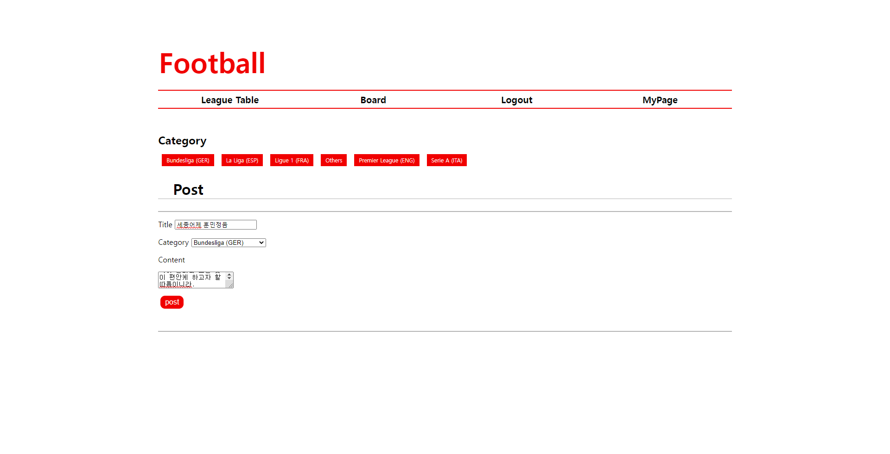
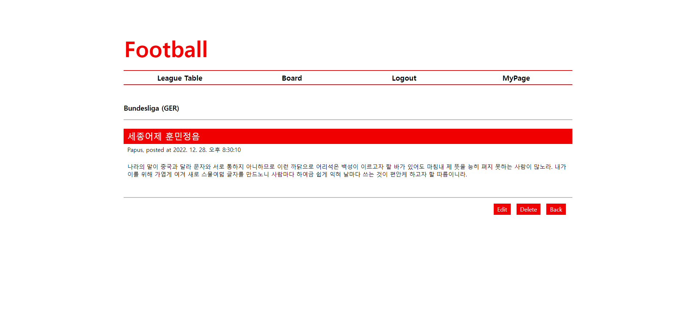
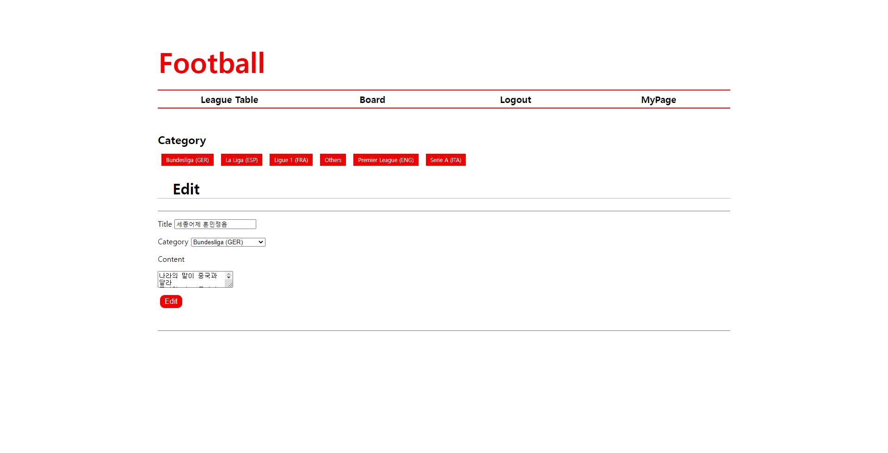
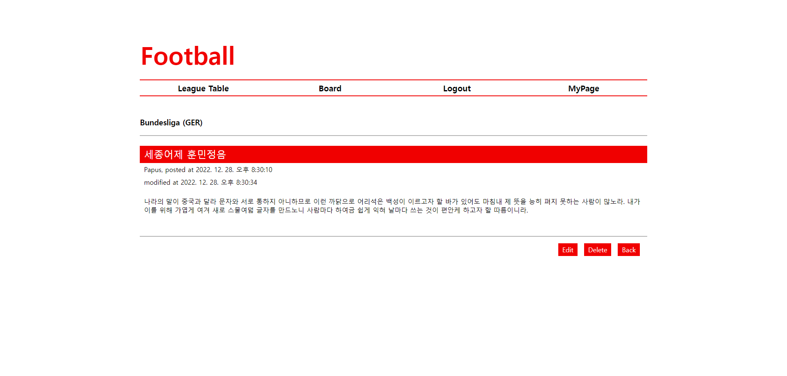
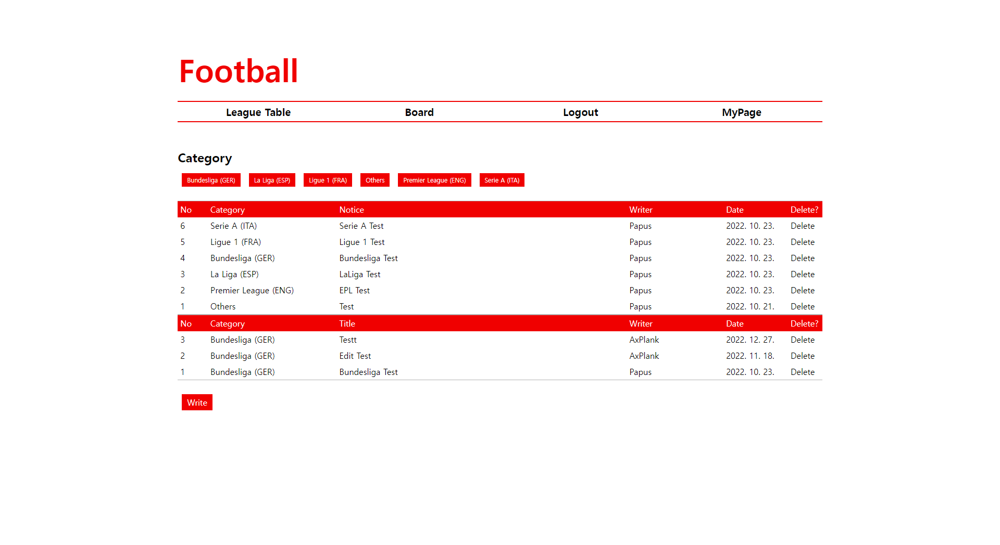

---
# 2022.12.27
## DB 호출 코드 수정
DB를 호출할 때 사용하는 코드를 수정했습니다. 기존에 호출할 때 사용할 값들에 대해선
```javascript
db.query('SQL', [values...], callback);
```
의 형태로 두 번째에 위치한 Array에 값을 위치시켜 사용했습니다. 하지만 이로 인해 'ERR_CONNECTION_RESET'이라는 에러가 발생하여 정상적으로 진행이 되지 않는 오류가 발생했습니다. 이에 Array에 값을 위치시키는 것이 아닌 SQL 구문에 값들을 직접 대입하여 사용하는 것으로 코드를 수정했습니다. 바꾼 후에는 전부 아래와 같이 코드가 수정되었습니다.
```javascript
db.query('SQL', callback);
```
## HTTP 에러 시 발생하는 URL 수정
HTTP 404, HTTP 500 등의 HTTP 에러 발생 시, 에러 내용과 관련된 창이 출현 back 버튼을 통해 상위 페이지로 이동할 수 있도록 설정되어 있습니다. 이때 일부 페이지가 상위 페이지로 부적절하다 생각하여 이를 수정했습니다.
## Board에 대한 글쓰기, 수정, 삭제 기능 추가
기존에 Board를 통해 게시판 기능을 구현하려 했지만, 실제로는 그러지 못했습니다. 그래서 구현하지 못했던 기능들을 일부 구현했습니다.

최초에는 게시글에 이미지, 동영상과 같은 미디어 파일을 업로드 할 수 있도록 하는 것이 목표였습니다. Express.js를 개발한 사람들이 만든 패키지인 multer라는 패키지를 이용해 미디어 업로드 기능까지 구현하려 했으나, 'ERR_CONNECTION_RESET' 오류가 지속적으로 발생하여 현재는 미디어 파일을 제외한 상태에서 구현했습니다.
### 글쓰기

Board로 들어오면 좌측 하단에 'Write'버튼이 있습니다. 이 버튼을 클릭하면 글을 쓸 수 있는 창이 열리고, 그 창에서 글을 쓸 수 있습니다. 이때, 제목과 내용은 반드시 작성해야 합니다. 글 작성 후 'Post' 버튼을 누르면 글이 저장되고, 아래의 화면처럼 기존의 게시글 조회 화면에서 최종 모습을 확인하게 됩니다.

### 글 수정하기

본인이 작성한 게시물이라면, 게시글 조회 화면의 우측 하단에 'Edit' 버튼이 존재할 것입니다. 이 버튼을 통해 해당 게시글을 수정하는 화면으로 이동해 게시글을 수정할 수 있습니다. 게시글을 수정하고 'Edit' 버튼을 누르면, 수정된 내용이 저장되고 이전 화면으로 돌아게게 됩니다. 이때, 전과는 달리 게시글을 최종적으로 수정한 시각이 화면에 표시됩니다.

### 글 삭제하기
글을 수정할 수 있다면 삭제도 할 수 있어야 할 것입니다. 게시글 조회 화면의 오른쪽 하단에 'Delete' 버튼을 이용하면 본인의 게시글을 삭제할 수 있습니다. 버튼을 누르면 게시글이 삭제되고, 해당 게시글의 상위 페이지로 이동하게 됩니다.

### 미디어 업로드 기능 구현 실패의 원인
미디어 업로드 구현 시 발생했던 오류를 해결하던 도중, 다른 기능에서 동일한 오류가 발생함을 확인하였기 때문에 현재 오류의 원인은 DB 호출 코드가 잘못된 것이라 생각됩니다. 하지만 multer를 사용하면서 발생한 오류는 DB 호출 코드의 콜백 함수가 실행되는 과정에서 발생했기 때문에 이 원인이 맞다고 완벽히 확신할 수는 없습니다. 

---