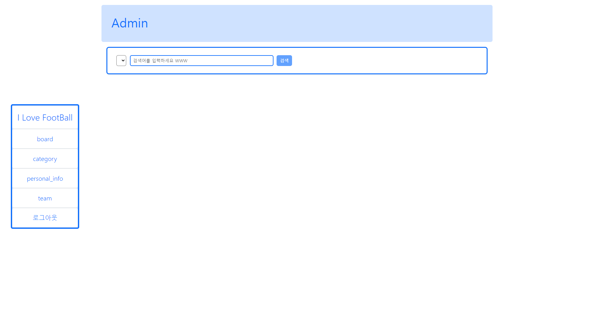
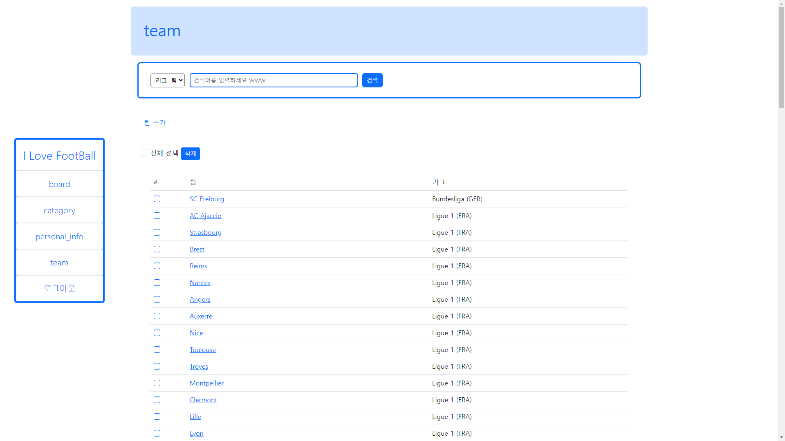
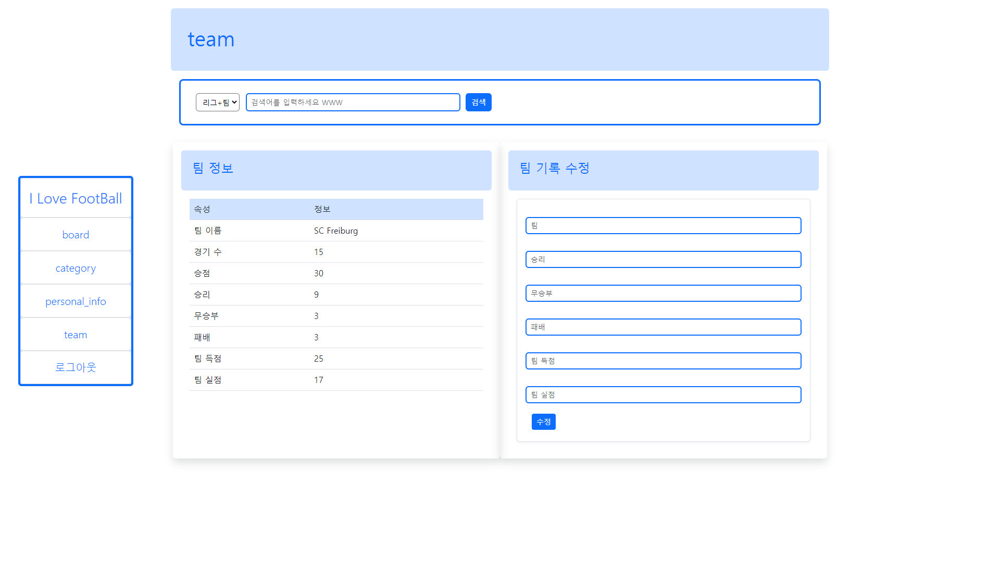
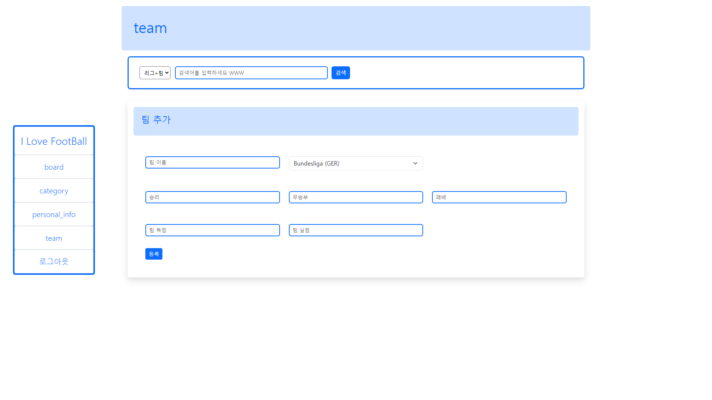

# Express.js Toyproject. I Love FootBall - 축구 커뮤니티 사이트
## 2nd. Admin
관리자가 회원, 게시글과 같은 데이터를 관리할 수 있는 페이지입니다. 

# 목표
1. Express.js를 이용해 REST API를 구현한다.
2. 관리자용 페이지를 제작해본다.
3. Bootstrap을 이용하여 웹 페이지를 디자인한다.

# 언어, 프레임워크, 툴
언어: Javascript, SQL, CSS, Markdown

프레임워크: express.js, pug, ejs, Bootstrap

툴: Visual Studio Code, MySQL, Git, Github

# 일정
| 기간 | 내용 | 비고 |
|---|---|---|
| 2023/01/23 ~ 01/25 | Git/GitHub 최초 커밋   관련 API 설치   MySQL 연동   static, view 등 기본 설정   readme.md 작성 |  |
| 01/25 ~ 01/26 | 관리자 로그인 기능 구현 |  |
| 01/26 ~ 01/27 | 관리자 페이지 기능 구현 |  |
| 01/28 ~ 02/01 | 게시판 기능 구현 |  |
| 02/01 ~ 02/04 | 테스트 진행   디자인 구현   readme.md 마무리 작성 |  |

# 기능
## Admin
게시글과 유저를 관리할 수 있는 관리자 전용 페이지입니다. Django에서 프로젝트를 생성할 때 만들어지는 관리자 페이지를 참고하여 만들었습니다.

## 메인 페이지

메인 페이지입니다. 좌측에 네비게이션 바가 위치해 있으며, 이것을 이용해 각 테이블과 관련된 페이지로 이동할 수 있습니다. 메인 페이지에서 검색 기능은 비활성화됩니다.

## 테이블 조회 페이지

테이블 조회 페이지입니다. 각 테이블에 저장되어 있는 인스턴스 목록이 나오며, 각각의 테이블과 관련된 기본적인 정보들이 출력됩니다. 원하는 인스턴스를 클릭하면 해당 인스턴스의 세부 정보를 조회하고 수정할 수 있는 페이지로 이동합니다.

일부 페이지의 경우, 해당 테이블에 인스턴스를 추가할 수 있는 창으로 이동하는 버튼이 존재하며, 검색 버튼의 조건과 검색어를 설정해 원하는 인스턴스를 검색할 수 있습니다.

## 인스턴스 조회 및 수정 페이지

인스턴스 조회 페이지입니다. 인스턴스가 가지고 있는 모든 정보가 표시되며, 각 인스턴스에 맞춰 정보를 일부 수정할 수 있습니다.

## 인스턴스 추가 페이지

인스턴스 조회 페이지입니다. 인스턴스가 가지고 있는 모든 정보가 표시되며, 각 인스턴스에 맞춰 정보를 일부 수정할 수 있습니다.