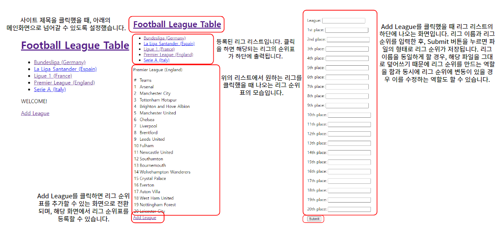

# Project: 5대 축구 리그 순위표

# Introduction
&nbsp;JavaScript는 웹에서의 다양한 동작을 구현하는 프론트엔드의 역할 뿐 아니라, 데이터베이스를 연동하고, API를 구현하는 백엔드의 역할도 할 수 있는 언어입니다. 그래서 저는 인프런 강의에서 배운 것을 토대로 JavaScript를 활용한 간단한 웹 서버를 제작해 보기로 하였습니다.

# Language and Framework


# Schedule

| 기간 | 내용 | 비고 |
|---|---|---|
| 2022/09/05 | Git/GitHub 연동, express.js, pug 등 라이브러리 설치 |  |
| 09/07 ~ 09/09 | 순위표 관련 API 구현 <br> View를 위한 pug 파일 작성 <br> 테스트 | 09/08에는 진행 X |

# UI



# Features
## 리그 순위표 추가
---

- 리그와 해당 리그의 순위표를 추가할 수 있는 기능입니다.
- 리그 이름, 리그 순위표를 입력하고 제출을 하면 리그 순위표가 파일의 형태로 저장됩니다.
- 파일의 제목이 같을 경우, 입력했을 때 해당 파일을 덮어쓰기 떄문에 순위표를 수정하는 기능도 할 수 있습니다.

## 리그 순위표 검색
---

- 리그를 클릭했을 때, 해당되는 리그의 순위표를 볼 수 있는 기능입니다.

# Feedback
## 1. 전송 방식의 차이에서 발생하는 오류
---
### 오류 내용
---

&nbsp;모든 코드를 작성하고 테스트를 진행했을 때 한 가지 문제점이 발생했습니다. 바로,

``` cmd

[Path]\app.js:63
                teams = teams.split(',');
                              ^

TypeError: Cannot read properties of undefined (reading 'split')
    at ReadFileContext.callback ([Path]\app.js:63:31)
    at FSReqCallback.readFileAfterOpen [as oncomplete] (node:fs:320:13)

Node.js v18.3.0
Program node app.js exited with code 1

```

위의 오류가 발생하면서 Add league 버튼을 눌렀을 때, 리그 순위표를 추가하는 화면으로 이동이 되지 않았던 것입니다. url을 직접 입력해도 들어가지지 않았으며, 이미 추가되어있는 데이터에 대한 조회를 할 때에는 실행 자체는 정상적으로 진행되나, 오류 문구는 계속해서 출력되는 모습을 보며 전 오류의 이유에 대해 생각하기 시작했습니다.

### 동기 방식과 비동기 방식
---

&nbsp;왜 오류가 발생했는지에 대해 생각하던 찰나, 전 JS의 함수는 대부분 작업을 다른 곳에 할당해 동시에 진행하는 비동기 방식이라는 것을 생각해 냈습니다. 그리고 비동기 방식의 특성을 고려한 가설을 하나 세울 수 있었습니다.

> _"파일을 읽는 작업과 파일 속의 데이터를 가공하는 작업이 동시에 진행되었다. 즉, 파일을 다 읽지 못한 상태에서 데이터 가공을 진행했기 때문에 에러가 발생한 것이다."_

&nbsp;이 가설을 토대로 하면 오류를 해결할 수 있는 방법은 바로 비동기 방식 대신 동기 방식의 함수를 이용하는 것이었습니다. 그래서 전 기존에 사용했던 함수인 readfile() 대신 동기 방식의 함수인 readfileSync()를 이용해 테스트를 진행했습니다.

&nbsp;하지만 이 방식 역시 완벽한 것은 아니었습니다. 오류는 해결되었으나, 프로그램의 성능이 떨어진 것이었습니다. 이에 저는 비동기 함수를 사용하는 대신, 코드를 한 줄씩 읽어 처리하는 인터프리터 언어의 특성을 참고해 코드 배치를 바꿈으로써 해결했습니다.

### 시간 지연
---

&nbsp;문제르